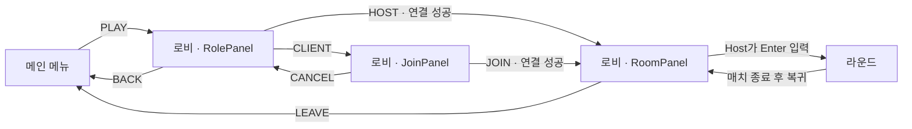

# UI 계층 구조

2026-09-09 기준. 씬 파일과 UI 스크립트를 읽어 정리한 구조이며, 실행 화면 검증은 하지 않았다. 트리는 부모·자식 관계 중심으로 표시하고 반복되는 버튼 라벨과 입력 필드 내부 Text는 생략했다. 괄호는 역할 설명이다.

## 화면 전환

현재 빌드에 포함된 씬은 MainMenuScene → PrototypeLobbyScene → PrototypeRoundScene이다.



## 씬에 저장된 UI

```text
MainMenuScene
└─ Canvas
   ├─ Background                  [비활성]
   ├─ DarkOverlay                 배경 위 어두운 오버레이
   ├─ GameTitle                   게임 제목
   ├─ PlayButton
   │  └─ Label
   └─ QuitButton
      └─ Label

PrototypeLobbyScene
├─ MatchingCanvas
│  ├─ Text                        매칭 제목
│  ├─ SideShade                   입장 화면 장식
│  ├─ RolePanel                   이름 입력 / 역할 선택
│  │  ├─ Input                    플레이어 이름
│  │  ├─ HOSTButton               방 생성
│  │  ├─ CLIENTButton             JoinPanel 열기
│  │  └─ BACKButton               메인 메뉴로 이동
│  ├─ JoinPanel                   방 참가
│  │  ├─ Text                     안내
│  │  ├─ Input                    6자리 방 코드
│  │  ├─ JOINButton               접속 요청
│  │  └─ CANCELButton             RolePanel 복귀
│  └─ RoomPanel                   연결 후 좌측 상단 HUD
│     ├─ Text × 4                 방 코드 / 인원 / 상태 / 안내
│     ├─ COPYButton               방 코드 복사
│     └─ LEAVEButton              나가기
└─ Canvas                         [비활성]
   └─ Text (TMP)

PrototypeRoundScene
└─ Canvas
   ├─ ActionBar                   하단 안내 텍스트
   ├─ Panel                       인트로 / 페이드 배경
   │  └─ DialogueText             패널 내부 텍스트
   └─ Center                      중앙 알림 텍스트
```

로비의 세 패널은 `PrototypeLobbyUI.ShowOnly()`가 하나씩 표시한다. RoomPanel을 표시하면 매칭 제목과 SideShade도 숨긴다. RoomPanel 위치와 텍스트 크기는 Awake에서 다시 설정된다.

메인 메뉴의 3D 배경은 `MainMenuRoundBackground`가 라운드 씬을 추가 로드해 만든다. 배경으로 로드한 씬의 Canvas는 비활성화한다.

## Hierarchy에 오브젝트로 나타나지 않는 라운드 UI

`PrototypeRoundManager` 오브젝트의 `PrototypeRoundView.OnGUI()`가 직접 그린다. 아래 항목은 논리적인 표시 구조이며 GameObject 이름이 아니다.

```text
PrototypeRoundView.OnGUI
├─ 좌측 상단: 라운드 번호 / 플레이어 목록
│  └─ 플레이어별 이름 · 생존/탈출 상태 · 왕관
├─ 상단 중앙: 시작 카운트다운 / 라운드 결과 / 최종 승자
└─ 하단 중앙: 로컬 플레이어 스태미나
   ├─ 수치: STAMINA / LAVA / FALL
   └─ 분할 바: 잔여 / 사용량 / 용암 피해 / 낙하 피해
```

스태미나는 로컬 플레이어가 플레이 구역에 있을 때 표시한다. Canvas의 대사 UI는 `DialogueController`, 위 HUD는 `PrototypeRoundView`가 각각 관리한다.

## 별도 구현 / 빌드 외 씬

`ScoreboardUI`는 실행 시 아래 GameObject를 생성하도록 구현되어 있다. 현재 프로젝트의 씬·프리팹에서 해당 스크립트 GUID 연결은 발견되지 않았다.

```text
ScoreboardUI가 붙은 오브젝트
└─ ScoreboardPanel
   ├─ Title                       PLAYERS
   └─ PlayerList
      └─ PlayerRow_{PlayerId}      플레이어마다 생성
         ├─ Face
         ├─ Name
         ├─ Crown1
         └─ Crown2
```

| 빌드 외 씬 | 저장된 UI |
|---|---|
| MatchingScene | Canvas → Text (TMP) |
| SampleScene | 직접 저장된 RectTransform UI 없음 |
| SampleScene2 | Canvas → StaminaBar → Background, Fill Area/Fill, CurrentSlider, MaxSlider |

위 세 씬은 `Assets/Scenes/Archive`로 이동했다. SampleScene2의 슬라이더 오브젝트는 이전 화면 참고용으로 남겨 두었으며, 사용하지 않는 스태미나 UI 스크립트와 씬의 컴포넌트 연결은 제거했다. 현재 빌드 라운드의 스태미나는 `PrototypeRoundView.OnGUI()`가 표시한다.

## 근거 파일

- [빌드 씬 목록](../ProjectSettings/EditorBuildSettings.asset)
- [메인 메뉴 씬](../Assets/Scenes/MainMenuScene.unity), [로비 씬](../Assets/Scenes/PrototypeLobbyScene.unity), [라운드 씬](../Assets/Scenes/PrototypeRoundScene.unity)
- [로비 UI 제어](../Assets/Script/Prototype/PrototypeLobbyUI.cs), [라운드 HUD](../Assets/Script/Prototype/PrototypeRoundView.cs), [대사 UI](../Assets/Script/UI/DialogueController.cs)
- [점수판 생성](../Assets/Script/dotori/ScoreboardUI.cs), [점수판 행](../Assets/Script/dotori/PlayerScoreRowUI.cs)
